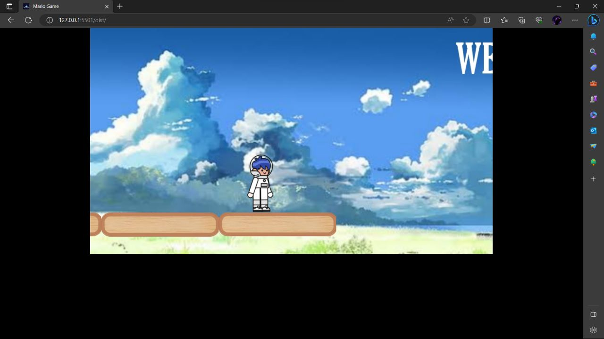
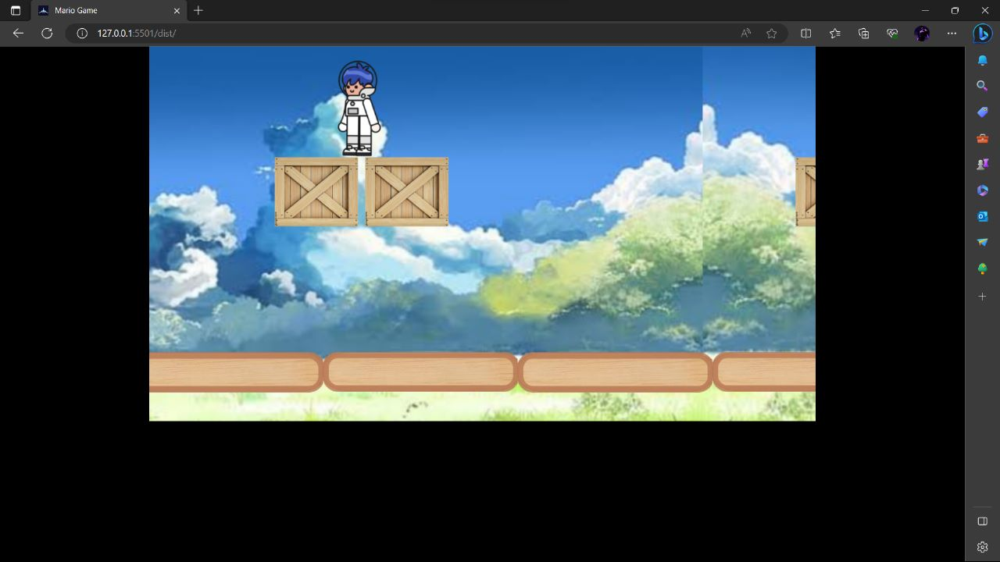

# Astro Boy - Web Game

Astro Boy is a web-based game created using HTML and JavaScript. It is designed to run on any modern web browser. This README file provides an overview of the game, its features, and instructions on how to run and play the game.

## Screenshots

## Game Features

- Simple and intuitive gameplay
- Endless runner-style game
- Control Astro Boy using arrow keys or touch gestures on mobile devices
- Collect power-ups and avoid obstacles
- Compete for the highest score
- Retro-inspired graphics and sound effects

## How to Play

1. Open the `index.html` file in your web browser.
2. The game will start automatically.
3. Use the arrow keys on your keyboard to move Astro Boy.
4. On mobile devices, swipe up, down, left, or right to control Astro Boy's movements.
5. Collect power-ups to gain points and increase your score.
6. Avoid obstacles to stay alive. Colliding with obstacles will end the game.
7. Try to achieve the highest score possible.

## Compatibility

Astro Boy is compatible with all modern web browsers, including:

- Google Chrome
- Mozilla Firefox
- Microsoft Edge
- Safari

## Credits

- Astro Boy game created by Mohammed Siddiq
- Retro graphics inspired by classic arcade games

## License

This project is licensed under the [MIT License](LICENSE).

Feel free to contribute to the project by opening issues and submitting pull requests on the GitHub repository.

Enjoy playing Astro Boy! If you have any questions or feedback, please don't hesitate to contact me.

## Contact

For any inquiries or support, please reach out to siddikhacker@gmail.com.
